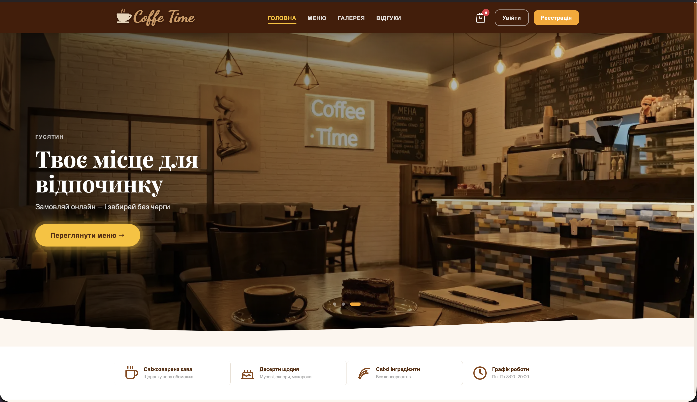
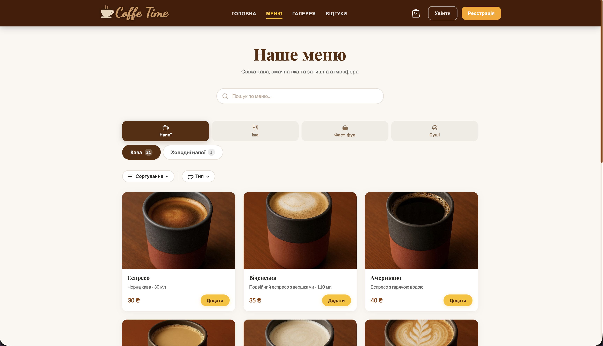
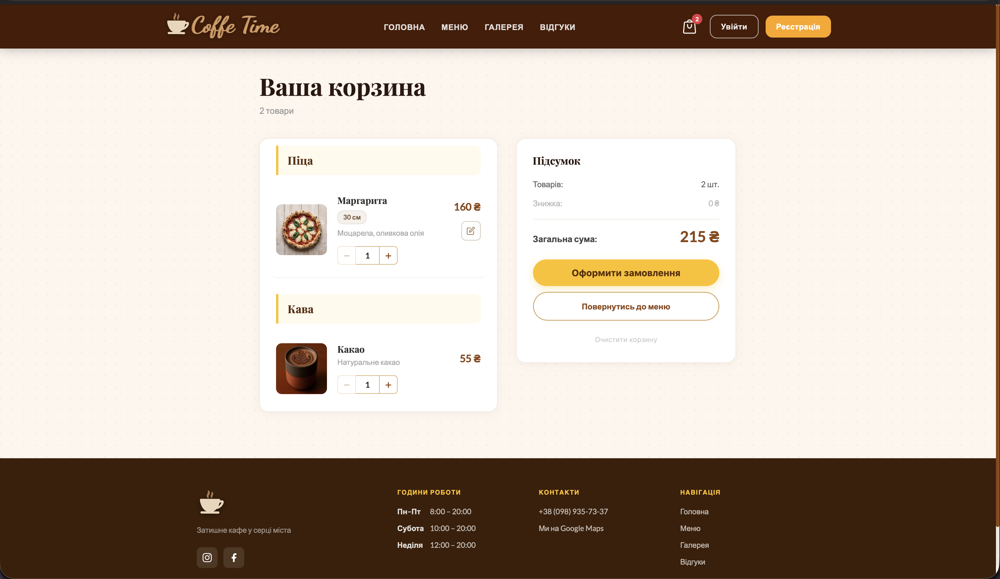
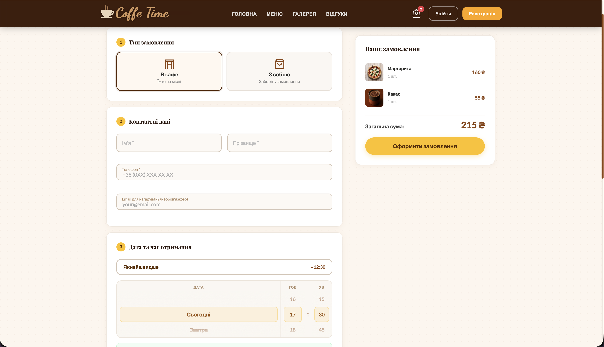
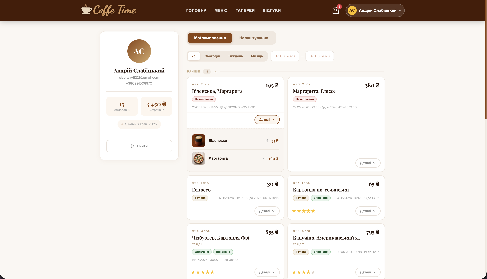
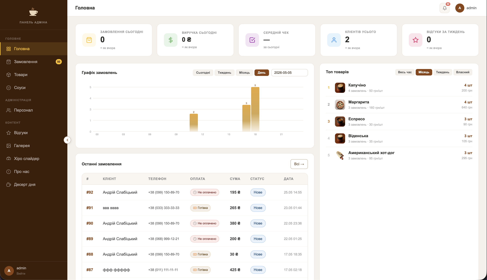

# Coffee Time — онлайн-замовлення для кафе

Повноцінний сайт для кафе **Coffee Time** (м. Гусятин) з меню, онлайн-замовленнями, оплатою та адмін-панеллю.

Спочатку написаний на PHP, потім повністю переписаний на Python/FastAPI
з ідентичною логікою, дизайном та функціоналом — деталі порту та
підтверджені виправлення багів у процесі дивись у [MIGRATION_NOTES.md](MIGRATION_NOTES.md).

## Скріншоти

| | |
|---|---|
|  |  |
| **Головна** — hero-слайдер з фото кафе, CTA-кнопка | **Меню** — каталог з пошуком, категоріями та фільтрами |
|  |  |
| **Кошик** — список товарів, зведення замовлення | **Оформлення** — тип доставки, контакти, барабанний picker часу |
|  |  |
| **Профіль** — історія замовлень зі статусами та оцінками | **Адмін** — дашборд зі статистикою, графіком та топ-товарами |

## Стек

| Шар | Технології |
|-----|-----------|
| Frontend | HTML, CSS, Vanilla JS |
| Backend | Python 3.12, FastAPI, Jinja2 |
| БД | PostgreSQL, SQLAlchemy 2.0, Alembic |
| Оплата | LiqPay SDK |
| Сповіщення | Telegram Bot API, smtplib (Gmail SMTP) |
| Інфраструктура | Docker, uvicorn |
| Тести | pytest, SQLite fixtures |

## Функціонал

- Каталог меню з фільтрацією, пошуком і категоріями
- Кошик із варіантами: розмір піци, борти, соуси, вага торту, морозиво на вагу
- Оформлення замовлення з вибором часу (барабанний picker) та типом оплати
- Онлайн-оплата через LiqPay (з sandbox-режимом)
- Telegram-сповіщення адміністратору при новому замовленні
- Email-нагадування клієнту перед готовністю замовлення (cron-джоба)
- Авторизація, реєстрація, відновлення паролю
- Профіль користувача з історією замовлень
- Відгуки клієнтів
- Адмін-панель з розмежуванням прав (super/staff): товари, замовлення,
  соуси, галерея, hero-слайдер, контент сторінки "Про нас"/банер дня,
  персонал, резервна копія БД

## Запуск через Docker

```bash
git clone https://github.com/DAROLEND/CoffeeTime.git && cd CoffeeTime
cp .env.example .env
# відредагувати .env (DB_NAME, DB_USER, DB_PASS, APP_URL, TELEGRAM_*, LIQPAY_*, MAIL_* тощо)

docker compose up -d --build
# сайт на http://localhost:8000
# схема БД створюється автоматично через Alembic при першому запуску
```

## Локальний запуск

```bash
python3 -m venv .venv
source .venv/bin/activate
pip install -r requirements.txt

cp .env.example .env   # налаштувати DB_* під локальний PostgreSQL

alembic upgrade head
uvicorn app.main:app --reload

# reminders cron-джоба (окремим процесом, кожні 15 хв):
python cron/send_reminders.py
```

## Деплой

Конфіг для безкоштовного хостингу на [Render](https://render.com) — `render.yaml`
(web-сервіс + cron-джоба нагадувань, БД — окремий безкоштовний Postgres,
напр. [Supabase](https://supabase.com) чи [Neon](https://neon.tech)).

## Тести

```bash
pytest tests/ -v
```

Ганяються проти SQLite (швидко, без зовнішніх залежностей) — деталі та
відома межа (один запит з `ORDER BY RANDOM()`, навмисно не покритий
тестом) описані в [MIGRATION_NOTES.md](MIGRATION_NOTES.md).

## Адмін-панель

```
/admin/login
```

## Змінні середовища

Всі секрети зберігаються в `.env` (не комітиться). Дивись `.env.example`.

```
APP_URL=https://yourdomain.com
DB_NAME=coffeetime
DB_USER=coffeetime
DB_PASS=secret
TELEGRAM_BOT_TOKEN=
LIQPAY_PUBLIC_KEY=
LIQPAY_PRIVATE_KEY=
MAIL_USERNAME=
MAIL_PASSWORD=
```
