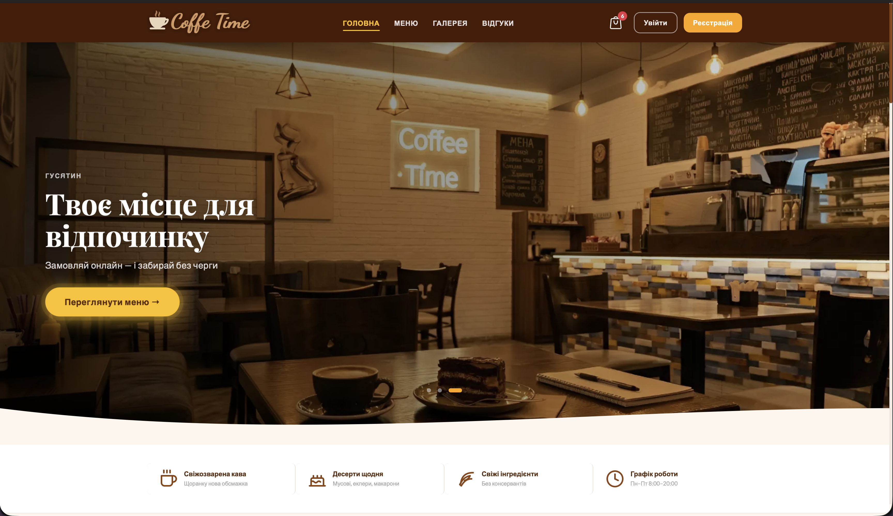
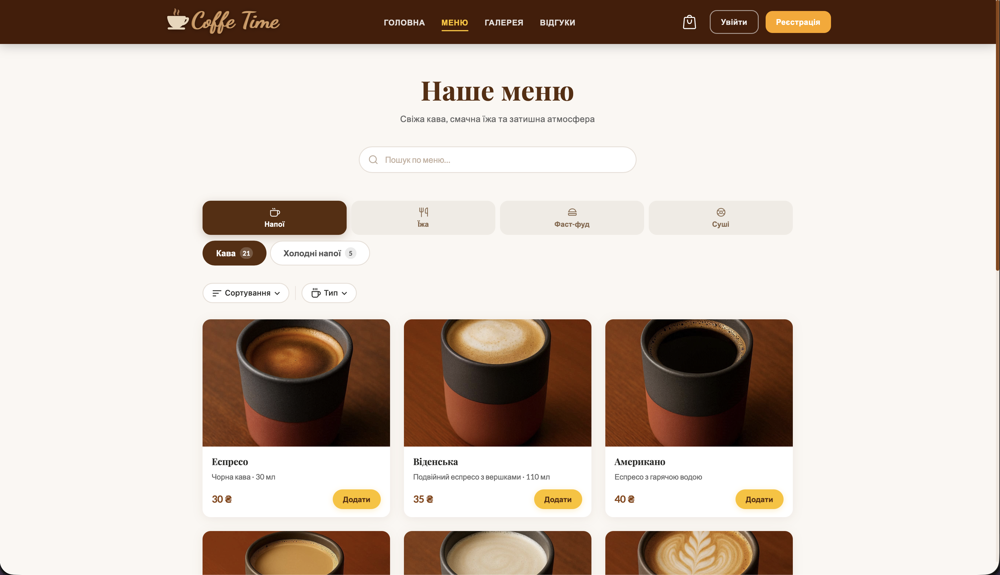
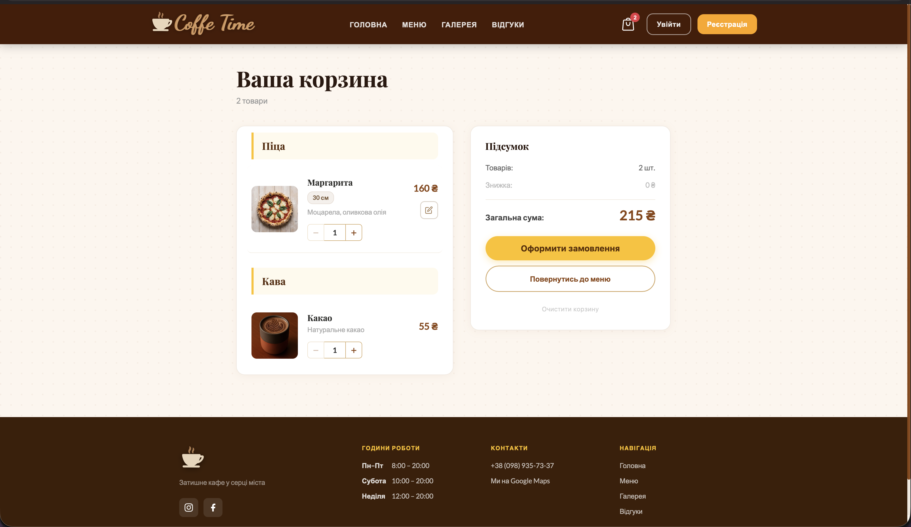
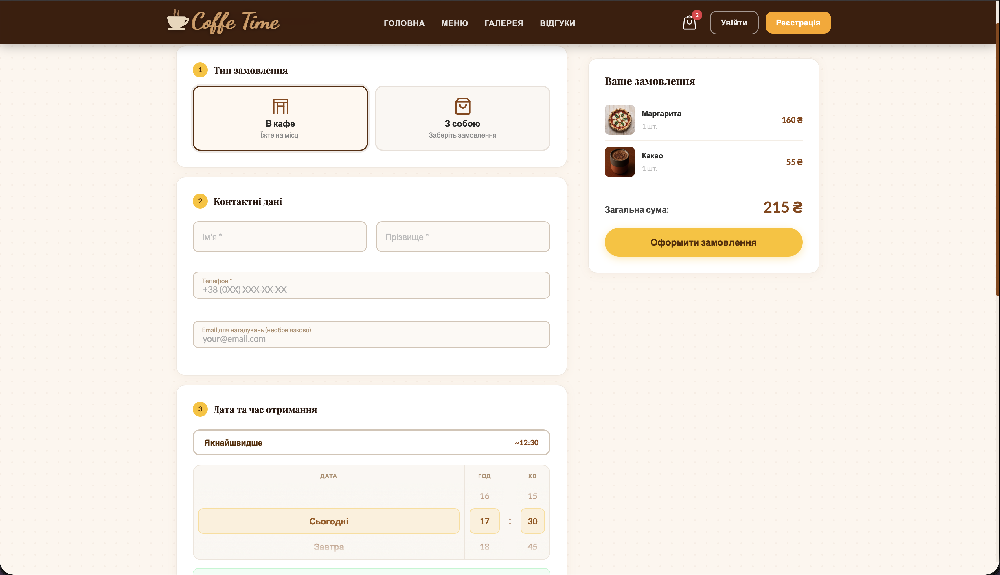
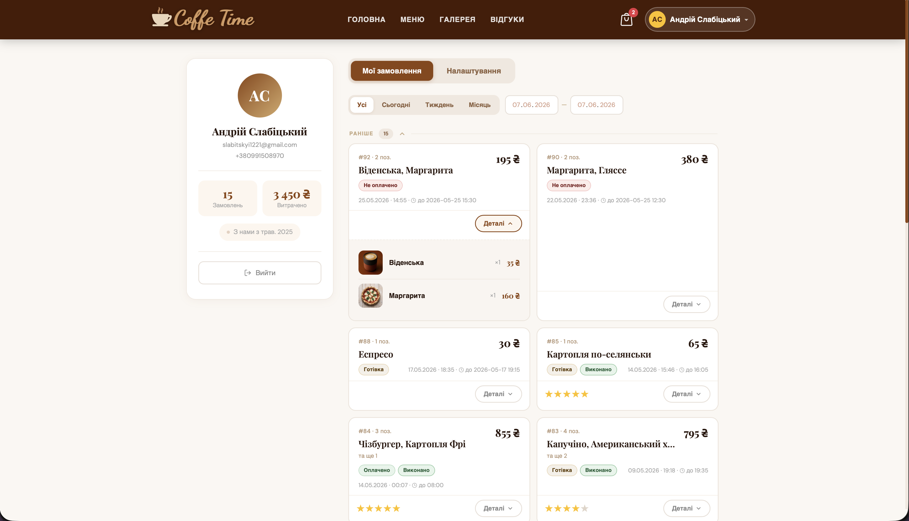
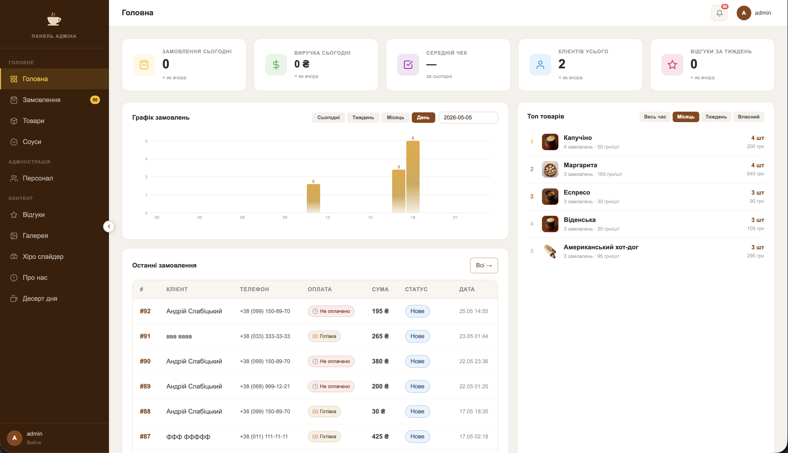

# Coffee Time — online ordering for a café

*Також доступно [українською](README.uk.md).*

### 🔗 Live site: **[coffeetime.onrender.com](https://coffeetime.onrender.com)**

A complete website for the **Coffee Time** café (Husiatyn, Ukraine) with a menu, online ordering,
payment via LiqPay, and an admin panel with role-based permissions.

The project is split into a **FastAPI JSON API** and a **React + TypeScript SPA**
that talks to it. The API's OpenAPI schema is the contract: the frontend's
request/response types are generated from it.

> Hosted on Render's free tier — the service sleeps after 15 minutes of
> inactivity, so the first load can take up to a minute.

## Screenshots

| | |
|---|---|
|  |  |
| **Homepage** — hero slider with café photos, CTA button | **Menu** — catalog with search, categories and filters |
|  |  |
| **Cart** — item list, order summary | **Checkout** — delivery type, contact info, a drum-style time picker |
|  |  |
| **Profile** — order history with statuses and ratings | **Admin** — dashboard with stats, a chart, and top items |

## Stack

| Layer | Technologies |
|-----|-----------|
| Frontend | React 19, TypeScript, Vite, React Router 7, TanStack Query 5, openapi-fetch + openapi-typescript |
| Backend | Python 3.12, FastAPI (JSON API under `/api`), Pydantic v2 |
| Database | PostgreSQL, SQLAlchemy 2.0, Alembic |
| Payments | LiqPay |
| Notifications | Telegram Bot API, smtplib (Gmail SMTP) |
| Infrastructure | Docker, uvicorn, Render (API web service + static site) |
| Tests | pytest (API, SQLite fixtures), Vitest + Testing Library (frontend) |

## Project structure

```
app/                    FastAPI backend
  main.py               app, exception handlers → {detail, code, errors}
  api/                  /api router (CSRF dependency), error helpers
  routers/public/       session, menu, cart, checkout, payments, auth, profile, reviews, pages
  routers/admin/        dashboard, orders, products, sauces, gallery, reviews, hero slides, …
  schemas/              Pydantic request/response models → /openapi.json
  services/             business logic (pricing, cart, checkout, LiqPay, reminders, …)
  models/               SQLAlchemy models
alembic/                migrations
cron/send_reminders.py  reminder e-mails (run every 15 minutes)
frontend/               React SPA
  src/api/              typed client (schema.d.ts is generated), CSRF, query hooks
  src/features/         storefront pages: home, menu, cart, checkout, payment, auth, profile, …
  src/admin/            admin panel (its own lazy-loaded chunk)
  src/styles/           the site's CSS, scoped per page (see postcss-scope-pages.ts)
tests/                  backend tests
```

## Features

- Menu catalog with filtering, search, and categories
- Cart with variants: pizza size, cheese crust, sauces, cake weight, ice cream scoops, fast-food fillings
- **Every price is computed on the server** from the database — the client only sends what was chosen
- Checkout with time selection (drum-style picker in the café's time zone) and payment type
- Online payment via LiqPay (with sandbox mode), a pending page that polls the payment status
- Telegram notification to the admin on every new order
- Email reminder to the customer before the order is ready (cron job)
- Authentication, registration, password recovery
- User profile with order history and ratings
- Customer reviews with moderation
- Admin panel with role-based permissions (super/staff): products, orders,
  sauces, gallery, hero slider, "About us" page content / banner of the day,
  staff, database backup

## API conventions

- Every route lives under `/api`; the interactive docs are at `/docs`.
- Auth is a server-side session in an httponly cookie (`coffeetime_session`,
  `Secure` in production, `SameSite=Lax`). No JWT.
- CSRF: `GET /api/csrf-token`, then send it as `X-CSRF-Token` on every
  POST/PUT/PATCH/DELETE. The frontend client does this automatically and
  retries once if the token has expired.
- Errors always look like `{"detail": "...", "code": "...", "errors": [...]}`.
- In production the SPA and the API share one origin (the static site
  proxies `/api/*`), so there is no CORS.

## Running locally

Backend:

```bash
python3 -m venv .venv
source .venv/bin/activate
pip install -r requirements.txt

cp .env.example .env   # configure DB_* for your local PostgreSQL

alembic upgrade head
uvicorn app.main:app --reload          # API at http://localhost:8000/api, docs at /docs

# reminders cron job (as a separate process, every 15 minutes):
python cron/send_reminders.py
```

Frontend (Node 20.19+ or 22):

```bash
cd frontend
npm install
npm run dev            # http://localhost:5173 — proxies /api and /static to :8000
```

Set `API_URL` to point the dev proxy elsewhere (`API_URL=https://… npm run dev`).

After changing an API schema, regenerate the TypeScript types:

```bash
npm run gen:api            # from the running backend's /openapi.json
npm run gen:api:offline    # or straight from the code, no server needed
```

## Running with Docker

```bash
git clone https://github.com/DAROLEND/CoffeeTime.git && cd CoffeeTime
cp .env.example .env
# edit .env (DB_NAME, DB_USER, DB_PASS, APP_URL, TELEGRAM_*, LIQPAY_*, MAIL_*, etc.)

docker compose up -d --build   # API + Postgres at http://localhost:8000
cd frontend && npm install && npm run dev   # SPA at http://localhost:5173
```

The DB schema is created automatically via Alembic on first run.

## Deployment

`render.yaml` is a [Render](https://render.com) Blueprint with three services:

- **coffeetime** — the API (Docker web service, health check `/api/health`);
- **coffeetime-web** — the SPA as a static site: `cd frontend && npm ci && npm run build`,
  published from `frontend/dist`, with rewrites `/api/*` and `/static/*` → the API
  and `/*` → `/index.html`;
- **coffeetime-reminders** — the reminders cron job.

The database is a separate free Postgres (e.g. [Supabase](https://supabase.com) or
[Neon](https://neon.tech)). Set `APP_URL` on the API to the SPA's public origin —
LiqPay return/callback URLs and password-reset links are built from it.
The Blueprint already sets it (and `FRONTEND_URL`) to `https://coffeetime-web.onrender.com`,
so **Blueprints → New Blueprint Instance** is all it takes.

## Tests

```bash
pytest tests/ -v            # backend: 242 tests
cd frontend && npm test     # frontend: Vitest + Testing Library
cd frontend && npm run build   # type-check (tsc -b) + production build
```

Backend tests run against an in-memory SQLite database and cover cart
pricing, checkout, payment callbacks, authentication, CSRF, admin
permissions and every API route. Frontend tests cover the pricing/time-slot
logic, the CSRF client and key screens (login, cart) against a stubbed API.

## Admin panel

```
/admin   (sign in on /login with an admin account)
```

## Environment variables

All secrets are kept in `.env` (not committed). See `.env.example`.

```
APP_URL=https://yourdomain.com     # the SPA's public origin
FRONTEND_URL=                      # optional: GET / on the API redirects here
DB_NAME=coffeetime
DB_USER=coffeetime
DB_PASS=secret
TELEGRAM_BOT_TOKEN=
LIQPAY_PUBLIC_KEY=
LIQPAY_PRIVATE_KEY=
MAIL_USERNAME=
MAIL_PASSWORD=
```
